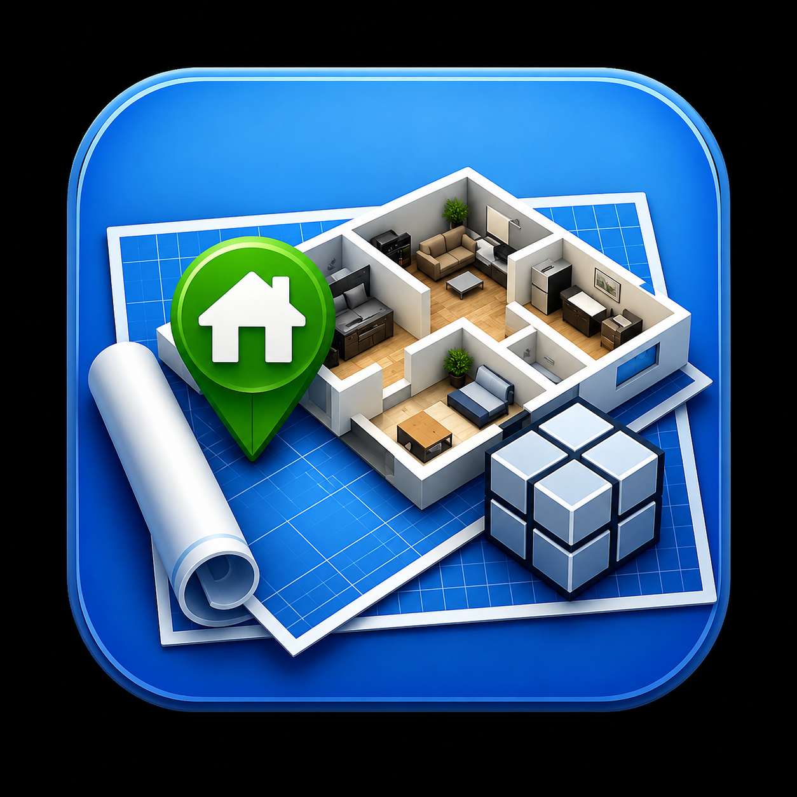

<p align="center">
  
</p>

<h1 align="center">HASS 3D Floorplan</h1>

<p align="center">
  <a href="https://github.com/hacs/integration"></a>
  <a href="https://github.com/Steven-D-Morgan/hass-3d-floorplan/releases"></a>
  <a href="https://github.com/Steven-D-Morgan/hass-3d-floorplan/releases/latest"></a>
</p>

<p align="center">Interactive 3D floorplan card for Home Assistant.<br>Render your home as a live 3D model with entity bindings for lights, doors, covers, sensors, and more.</p>

<p align="center">
  
  <br>
  <em>A real home rendered by the card. Walk through its configuration in <a href="#example-a-complete-home">Example: a complete home</a>.</em>
</p>

> Based on [floor3d-card](https://github.com/adizanni/floor3d-card) by Andrea Di Zanni.

## Installation

### HACS (recommended)

Add this repository as a custom repository in HACS:

1. Open HACS in your Home Assistant instance
2. Go to Frontend
3. Click the three dots menu and select "Custom repositories"
4. Add `https://github.com/Steven-D-Morgan/hass-3d-floorplan` with category "Lovelace"
5. Install "HASS 3D Floorplan"

### Manual

Download `hass-3d-floorplan.js` from the [latest release](https://github.com/Steven-D-Morgan/hass-3d-floorplan/releases) and upload it to your `www` folder in Home Assistant.

Load as a `module`:

```yaml
- url: /local/pathtofile/hass-3d-floorplan.js
  type: module
```

See Home Assistant documentation for [adding custom cards](https://developers.home-assistant.io/docs/frontend/custom-ui/custom-card) and [registering JavaScript resources](https://developers.home-assistant.io/docs/frontend/custom-ui/registering-resources).

## Model Design and Installation

Use a 3D modeling software. Recommended: [SweetHome3D](http://www.sweethome3d.com/).

Model your home with all needed objects and furniture.
At the end of your modeling, export the files in OBJ format using '3D View > Export to OBJ format ...'.
Copy the full set of files (minimum is the .obj file and .mtl file) to a sub folder of `/config/www` in Home Assistant.

Be aware that when you remove objects from the model the object IDs get reassigned. After a modification and re-export it is possible you need to redo the bindings with the new object names. The ExportToHASS plugin for SweetHome3D can help with this (see below).

Tips:
- Place the upper left corner of your 2D floor model at 0,0 coordinates for correct camera behavior
- Make objects invisible instead of removing them to preserve object IDs

### ExportToHASS plugin (recommended)

[ExportToHASS](https://github.com/adizanni/ExportToHASS) is a SweetHome3D plugin (by the original floor3d-card author) that exports models tailored for this card. Compared to the built-in OBJ export it:

- Preserves object IDs across re-exports, so your entity bindings don't break when the model changes
- Exports level/floor information so the card's level buttons work
- Sets up door/window objects (hinge, pane) for the `door` binding type
- Handles the transparent-slab logic used by the `sky` feature

**Download:** [ExportToHASSPlugin.sh3p](https://github.com/adizanni/ExportToHASS/releases/latest/download/ExportToHASSPlugin.sh3p)

**Install:** double-click the downloaded `.sh3p` file, or in SweetHome3D go to **Tools > Import plugin** and select it. The plugin is experimental — use at your own risk.

When you are finished, configure a new card (either in panel mode or regular) with the following options.

### GLB format

To generate a GLB file instead of OBJ (faster and more optimized):

```bash
npm install -g obj2gltf
```

Then convert your model:

```bash
obj2gltf --checkTransparency -i home.obj -o home.glb
```

The GLB file is self-contained so you only need that one file to load the model.

## Options

| Name             | Type   | Default      | Description                                                                                                                                                                |
| ---------------- | ------ | ------------ | -------------------------------------------------------------------------------------------------------------------------------------------------------------------------- |
| type             | string | **Required** | `custom:hass-3d-floorplan`                                                                                                                                                 |
| name             | string | Floor 3d     | the name of the card                                                                                                                                                       |
| entities         | array  | none         | list of entities to bind to 3D model objects                                                                                                                               |
| object_groups    | array  | none         | list of object groups to apply grouped entity bindings                                                                                                                     |
| style            | string | none         | the style that will be applied to the canvas element of the card                                                                                                           |
| path             | string | **Required** | path to the OBJ/MTL/GLB model files                                                                                                                                       |
| objfile          | string | **Required** | object file name (.obj or .glb)                                                                                                                                            |
| mtlfile          | string | **Required** | material file name (.mtl), only relevant for OBJ format                                                                                                                    |
| backgroundColor  | string | '#aaaaaa'    | canvas background color: #RGB notation, color name, or 'transparent'                                                                                                      |
| header           | string | 'yes'        | if the header will be displayed or not                                                                                                                                     |
| editModeNotifications | string | 'yes'   | 'yes' to use double click in edit mode to show object IDs or camera position                                                                                               |
| selectionMode    | string | 'no'         | 'yes' to activate selection mode for selecting groups of objects                                                                                                            |
| globalLightPower | float  | 0.5          | intensity of the scene light (can also be the name of a numeric sensor)                                                                                                    |
| shadow           | string | no           | 'yes' if lights cast shadow on objects (realistic but impacts performance)                                                                                                 |
| extralightmode   | string | no           | 'yes' to activate extra light mode, limiting shadow-casting lights for performance                                                                                          |
| overlay          | string | no           | 'yes' to show an overlay panel for displaying entity data on click                                                                                                         |
| click            | string | no           | 'yes' to enable click events (disables double click, manage behavior per entity via action parameter)                                                                      |
| lock_camera      | string | no           | 'yes' to disable zoom and rotate camera actions                                                                                                                            |
| show_axes        | string | no           | 'yes' to show axes in the scene (helps define spotlight direction vectors)                                                                                                 |
| sky              | string | no           | 'yes' to show sky, ground, and sun based on sun.sun entity                                                                                                                 |
| north            | string | see desc     | north direction on x-z plane, e.g. `{x: 0, z: 1}` (default). Used with sky                                                                                               |
| overlay\_<style> | string | various      | customize overlay panel appearance (colors, fonts, etc.)                                                                                                                   |
| max_pixel_ratio  | float  | 2            | cap on the device pixel ratio used for rendering. Phones report 3+, which is expensive for little visual gain; lower to 1 or 1.5 for faster rendering on weak devices      |
| model_cache      | string | 'yes'        | cache the model file on the device for instant repeat loads (needs HTTPS; updates are picked up in the background — see [Mobile performance](#mobile-performance))         |
| draco_decoder_path | string | see desc   | URL of the Draco decoder for Draco-compressed .glb files. Default: `https://www.gstatic.com/draco/versioned/decoders/1.5.6/`. Self-host and set this for offline setups   |
| debug            | string | no           | 'yes' to print verbose loading/lifecycle logs to the browser console. Off by default; warnings and errors are always shown                                                 |

**Note on sky:** When using sky, the sun going above the ceiling can cause strange illumination. Place a transparent slab object (transparent box) on top of your floor named `transparent_slab*` to block sunlight from above. You can also activate the ceiling in SweetHome3D.

North setting example:
```yaml
north:
  x: -1
  z: 0
```

## Entity Configuration

For each entity in the entities list:

| Name            | Type   | Default      | Description                                                                                                                                                                                                                                                                                         |
| --------------- | ------ | ------------ | --------------------------------------------------------------------------------------------------------------------------------------------------------------------------------------------------------------------------------------------------------------------------------------------------- |
| entity          | string | **Required** | your entity ID or reference to an object_group via `<object_group>` reference                                                                                                                                                                                                                       |
| entity_template | string | none         | a JavaScript template: `[[[ template]]]`. Use `$entity` for the entity state                                                                                                                                                                                                                        |
| action          | string | none         | on-click behavior: 'more-info', 'overlay', or 'default'                                                                                                                                                                                                                                            |
| object_id       | string | **Required** | the name of the object in the model to bind to your entity                                                                                                                                                                                                                                          |
| type3d          | string | **Required** | the type of binding: light, hide, show, color, text, gesture, door, cover, rotate, room, camera                                                                                                                                                                                                     |

**Tip:** Load the model without entity bindings and double click on objects in edit mode to discover their object_id.

## Object Groups

| Name         | Type   | Default      | Description                                                                                                                             |
| ------------ | ------ | ------------ | --------------------------------------------------------------------------------------------------------------------------------------- |
| object_group | string | **Required** | group name, referenced by entities via `<object_group>` syntax                                                                          |
| objects      | array  | **Required** | list of `{object_id: "..."}` entries                                                                                                    |

## Zoom Areas

| Name             | Type   | Default         | Description                                                |
| ---------------- | ------ | --------------- | ---------------------------------------------------------- |
| zoom             | string | **Required**    | name of the zoom area (e.g. Kitchen)                       |
| object_id        | string | **Required**    | object ID of the zoom target                               |
| rotation         | object | {x:0, y:0, z:0} | camera rotation                                           |
| direction        | object | {x:0, y:0, z:0} | camera direction vector                                   |
| distance         | number | 500             | cm from camera to target                                   |
| level            | number | -               | if set, shows only this level when zoomed                  |

### Client Side JavaScript template example

```yaml
- entity: sensor.temperature
  type3d: color
  colorcondition:
    - color: red
      state: hot
  object_id: your_object
  entity_template: '[[[ if ($entity > 25) { "hot" } else { "cool" } ]]]'
```

## Camera Rotation, Camera Position and Camera direction

```yaml
camera_position:
  x: <x coordinate>
  y: <y coordinate>
  z: <z coordinate>
camera_rotate:
  x: <x coordinate>
  y: <y coordinate>
  z: <z coordinate>
camera_target:
  x: <x coordinate>
  y: <y coordinate>
  z: <z coordinate>
```

Double click empty model space in edit mode to retrieve the current camera position and rotation.


## Overlay and action

Enable overlay in the Appearance section, then set `click: 'yes'`. Use `action: overlay` on entities to display state in the overlay panel, or `action: more-info` to open the entity dialog.

```yaml
overlay: 'yes'
overlay_bgcolor: transparent
click: 'yes'
entities:
  - entity: <your_entity>
    object_id: <your_object_id>
    action: overlay
```

## Binding Types

### Camera

```yaml
entities:
  - entity: camera.<camera_name>
    type3d: camera
    object_id: <object_id>
```

Double clicking the object shows a popup with the camera picture.

### Lights

```yaml
entities:
  - entity: <light_entity_id>
    type3d: light
    object_id: <object_id>
    light:
      lumens: <0-4000>
      color: <light color>
      decay: <0-2>
      distance: <cm>
      shadow: <'no' to disable shadow for this light>
      vertical_alignment: <'top', 'middle', 'bottom'>
      light_target: <object_id for spotlight target>
      light_direction: <{x, y, z} direction vector for spotlight>
```

### Hide / Show

```yaml
entities:
  - entity: <binary_sensor_id>
    type3d: hide   # or 'show'
    object_id: <object_id>
    hide:
      state: <state that triggers hiding, e.g. 'off'>
```

### Color

```yaml
entities:
  - entity: <sensor_id>
    type3d: color
    object_id: <object_id>
    colorcondition:
      - color: <hex, name, or rgb>
        state: <entity state>
```

### Text

```yaml
entities:
  - entity: <sensor_id>
    type3d: text
    object_id: <plane_object_id>
    text:
      span: <percentage, e.g. 50%>
      font: <font name>
      textbgcolor: <background color>
      textfgcolor: <foreground color>
      attribute: <optional entity attribute>
```

### Room

```yaml
entities:
  - entity: <entity>
    type3d: room
    object_id: <room_object with "room" in name>
    room:
      elevation: <cm floor to ceiling>
      transparency: <percentage>
      color: <color>
      label: <'yes' or 'no'>
      span: <percentage>
      font: <font name>
      textbgcolor: <background color>
      textfgcolor: <foreground color>
      attribute: <optional attribute>
    colorcondition:
      - color: <>
        state: <>
```


### Gesture

```yaml
entities:
  - entity: <entity>
    type3d: gesture
    object_id: <object_id>
    gesture:
      domain: <service domain>
      service: <service name>
```

Double click calls `domain.service` with `{ entity_id: entity }`.

### Door

```yaml
entities:
  - entity: <on/off entity>
    type3d: door
    object_id: <door object or group>
    door:
      doortype: <'slide' or 'swing'>
      side: <'up', 'down', 'left', 'right'>
      direction: <'inner' or 'outer'>
      hinge: <hinge object_id>
      pane: <pane object_id>
      degrees: <opening degrees>
```

### Cover

```yaml
entities:
  - entity: cover.<entity>
    type3d: cover
    object_id: <cover object or group>
    cover:
      pane: <moving parts object_id>
      side: <'up' or 'down'>
```

### Rotate

```yaml
entities:
  - entity: <on/off entity>
    type3d: rotate
    object_id: <object or group>
    rotate:
      axis: <'x', 'y', or 'z'>
      round_per_second: <1-4, negative for reverse>
      hinge: <pivot object_id>
      ramp: <seconds to spin up / coast down; default 1.5, set 0 for instant>
```

The object spins while the bound entity is `on` and stops when `off`. If the entity exposes a `percentage` attribute (e.g. a `fan`), the spin speed scales with it — a fan at 50% spins at half of `round_per_second`. A `direction` attribute of `reverse` flips the spin direction.

`ramp` controls the spin-up and coast-down easing so the object accelerates and slows down naturally instead of snapping between speeds. It defaults to `1.5` seconds; set it to `0` for the old instant behavior.

Example — a ceiling fan:

```yaml
entities:
  - entity: fan.living_room
    type3d: rotate
    object_id: <fan blades object or group>
    rotate:
      axis: y
      round_per_second: 3
      hinge: <center hub object>
      ramp: 2
```

## Quick Start Example

```yaml
type: 'custom:hass-3d-floorplan'
entities:
  - entity: <your_light_entity>
    type3d: light
    object_id: sweethome3d_opening_on_hinge_2_LampSide_31
    light:
      lumens: 500
  - entity: <your_binary_sensor>
    type3d: color
    object_id: sweethome3d_window_pane_on_hinge_1_50
    colorcondition:
      - state: 'on'
        color: '#00ff00'
      - state: 'off'
        color: '#ff0000'
path: /local/home2/
objfile: MyExampleHome2.obj
mtlfile: MyExampleHome2.mtl
backgroundColor: '#000001'
globalLightPower: 0.4
```

## Example: a complete home

The screenshot at the top of this page is a real two-storey home driven by the card. The full configuration is included in this repo at [`_resources/hass-3d-floorplan-card.yaml`](_resources/hass-3d-floorplan-card.yaml) — copy it as a starting point and swap in your own entity IDs and object names. The sections below walk through the techniques it demonstrates.

<p align="center">
  
</p>

### Object groups — bind one entity to many meshes

Exported models often split a single real-world object (a garage door, a multi-part front door, a set of recessed cans) into many meshes. Declare an **object group** once, then reference it from an entity as `<GroupName>`:

```yaml
object_groups:
  - object_group: GarageDoor
    objects:
      - object_id: Garage_Door_1
      - object_id: Garage_Door_2
  - object_group: KitchenCans
    objects:
      - object_id: Kitchen_Can_1_1
      - object_id: Kitchen_Can_2_1
      - object_id: Kitchen_Can_3_1
      - object_id: Kitchen_Can_4_1
```

### Locks and doors — tint a mesh by state (`type3d: color`)

A `color` binding recolors its object(s) per entity state. Here a deadbolt turns its door green when locked, red when unlocked:

```yaml
- entity: lock.front_door_deadbolt
  type3d: color
  object_id: <FrontDoor>          # references the FrontDoor object group
  colorcondition:
    - state: locked
      color: '#4caf50'
    - state: unlocked
      color: '#f44336'
```

### Garage — a cover that slides open (`type3d: cover`)

A `cover` binding clips the mesh open in proportion to the entity's `current_position`. `pane` is the surface it slides along and `side` is the direction it opens:

```yaml
- entity: cover.garage_door
  type3d: cover
  object_id: <GarageDoor>
  cover:
    pane: <GarageDoor>
    side: up
    percentage: '90'
```

### Lights — glow from a fixture mesh (`type3d: light`)

A `light` binding places a virtual light at the fixture and follows the entity's on/off, brightness, and (optionally) color. Add `color: rgb` to make the emitted colour track the light's `rgb_color` attribute — used here for the living-room cans:

```yaml
- entity: light.kitchen_ceiling
  type3d: light
  object_id: <KitchenCans>
  light:
    lumens: '800'

- entity: light.living_room_front_left
  type3d: light
  object_id: Living_Room_Front_Left_1
  light:
    lumens: '800'
    color: rgb
```

### Rooms — light up the floor plane

For an at-a-glance "which rooms are on" view, tint each room's floor plane by its light's state. If you export with the [ExportToHASS](https://github.com/adizanni/ExportToHASS) plugin, room floors are named `room_N_1`:

```yaml
- entity: light.kitchen
  type3d: color
  object_id: room_20_1
  colorcondition:
    - state: 'on'
      color: '#fff9c4'      # warm glow
    - state: 'off'
      color: '#212121'      # dark
```

### Camera framing

The `camera_position`, `camera_rotate`, and `camera_target` in the example set the opening view. To capture your own, open the dashboard in edit mode and double-click an empty part of the canvas after positioning the camera — the card prints the YAML for the current view (see [Camera Rotation, Camera Position and Camera direction](#camera-rotation-camera-position-and-camera-direction)).

## Working with levels

If your SweetHome3D model has levels and you use the [ExportToHASS](https://github.com/adizanni/ExportToHASS/releases/latest/download/ExportToHASSPlugin.sh3p) plugin, level buttons appear at the top left of the 3D canvas. Click a level to show only that floor, or click "all" to show the full model.

## Mobile performance

Most of the time you wait when opening the card on a phone is spent downloading the model file. Three things cut this down:

### 1. Compress your .glb model (biggest win)

The card supports **Draco** and **meshopt** compressed GLB files, which are typically 5–10x smaller than uncompressed exports:

- **Draco** (recommended — preserves object names, so entity bindings keep working):
  - Blender: enable the *Compression* checkbox in the glTF export dialog, or
  - command line: `npx gltf-pipeline -i home.glb -o home-draco.glb -d`
- **meshopt**: `npx gltfpack -i home.glb -o home-opt.glb -cc -kn` — **the `-kn` flag is required**, otherwise gltfpack renames objects and your `object_id` bindings break. Verify your bindings still work after packing.

Decompression is fast, and the Draco decoder itself is only downloaded when the model actually uses Draco. By default it comes from Google's CDN; for fully offline setups, copy the [decoder files](https://github.com/mrdoob/three.js/tree/r130/examples/js/libs/draco/gltf) (`draco_wasm_wrapper.js`, `draco_decoder.wasm`) to your `www` folder and set `draco_decoder_path: /local/draco/`.

### 2. Model caching (automatic)

When Home Assistant is served over HTTPS (e.g. via the companion app with a Nabu Casa or reverse-proxy URL), the card stores the model on the device and repeat loads are near-instant. It re-checks the server in the background and picks up a changed model on the next dashboard load. If you are actively iterating on your model and want changes immediately, either set `model_cache: no` or bump a version query on the file name (`objfile: home.glb?v=2`), which also busts the cache.

### 3. Rendering resolution cap

The card now renders at a maximum device pixel ratio of 2 by default (phones report 3+, which more than doubles the pixels rendered for no visible difference on a floorplan). Set `max_pixel_ratio: 1.5` or `1` if an older device still struggles, or raise it if you want maximum sharpness on a desktop monitor.

## GPU Performance Tips

If rendering is slow, ensure your browser is using your dedicated GPU:

- **Firefox**: NVIDIA Control Panel > 3D Settings > Program Settings > Mozilla Firefox > High performance NVIDIA. In Firefox, set `webgl.disable-angle` to `true` in `about:config`.
- **Chrome**: NVIDIA Control Panel > 3D Settings > Program Settings > Google Chrome > High performance NVIDIA. In Chrome, set `chrome://flags/#use-angle` to OpenGL.
- **Edge**: NVIDIA Control Panel > 3D Settings > Program Settings > Edge > High performance NVIDIA. Set `edge://flags/#use-angle` to OpenGL.

## Development

```bash
npm install
npm run build      # lint + bundle to dist/hass-3d-floorplan.js
npm start          # watch build with a dev server on :5000
```

### Tests

A headless smoke test boots the built card against a stubbed Home Assistant, loads a real GLB, and asserts the model actually renders to the WebGL canvas (guarding the full fetch → cache → parse → render pipeline).

```bash
npm test
```

This rebuilds `dist/`, generates a throwaway model fixture, and runs Playwright against headless Chromium. The same job runs in CI on every push and pull request. The browser test harness lives in [`dev/`](dev/) and is handy for reproducing rendering issues outside a full Home Assistant install.

## License

MIT - See [LICENSE](LICENSE) for details.
